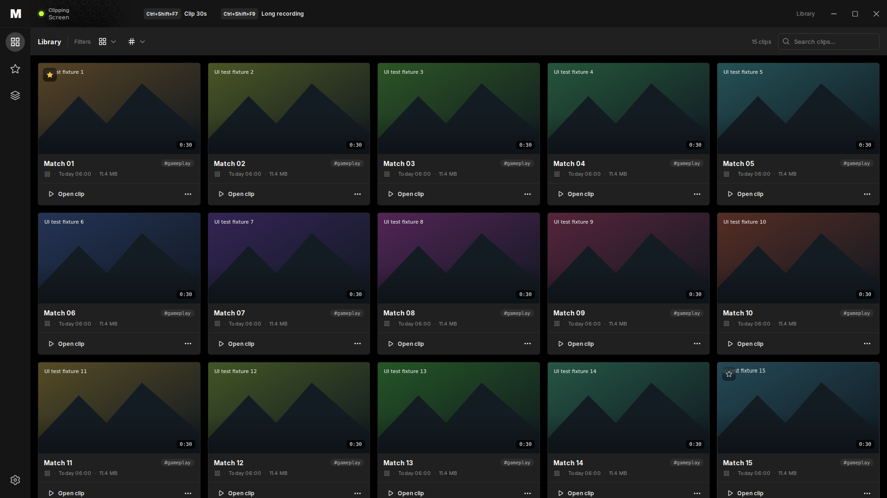
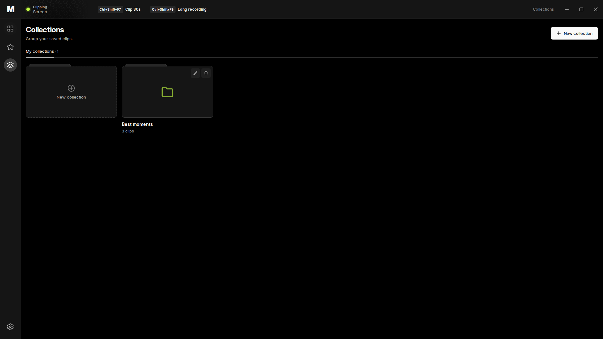
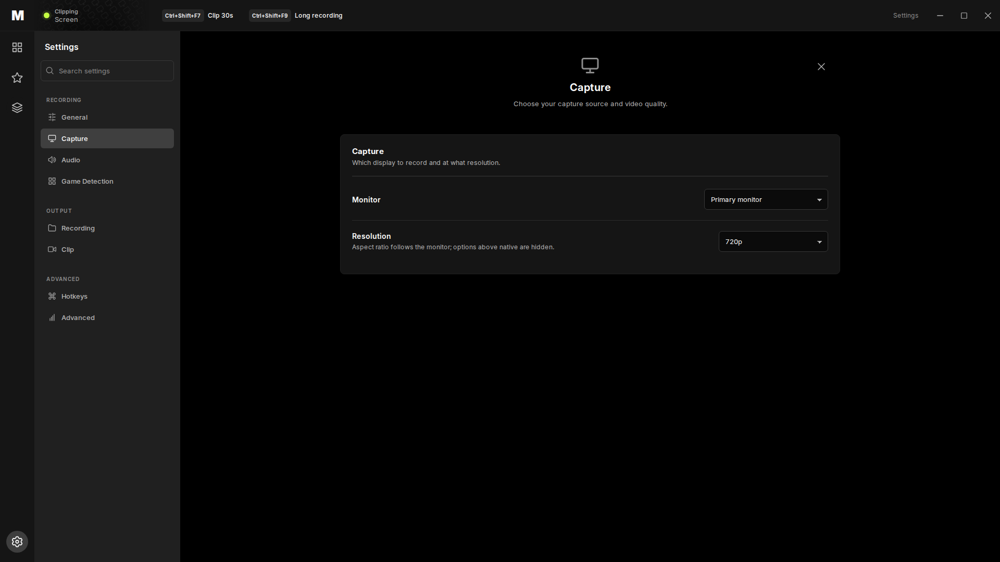

# Screenshot-based UI redesign

Date: 2026-10-08
Baseline: `3cff095825edd5ace5e65c168c3ed3863e727f63` (merged updater PR #6).
Desktop UI version: 1.5.0. Engine and updater versions are unchanged.

## Reference and scope

The user's eight screenshots are the visual reference. They determine the
layout, density, colors and control treatment. Existing Monolith pages retain
Monolith's local recording and clip-management behavior.

| Screenshot reference | Implementation |
| --- | --- |
| Library | 60 px status bar, compact icon rail, full-width filter toolbar, five 16:9 cards per row at 1920 px, gray metadata/footer surfaces and clip actions. |
| Settings | Full page with secondary navigation, page search, centered icon/title, bounded content width and dark cards with divided setting rows. |
| Albums | Folder-shaped collection cards, creation tile, heading and existing rename/delete actions. |
| Storage dialog and capture popover | Black/gray palette, white primary and outlined secondary buttons, lime capture/selection accents, concise modal spacing and capture controls. |
| Home, games and help | Secondary style references for type, spacing and controls. They do not introduce social feeds, ads, cloud subscriptions or unsupported Monolith pages. |

Theme values are centralized in `ui/styles.css`. Shared button styling is in
`ui/controls.css`, with a native Preact adapter for shadcn Button variants in
`ui/src/components/ui/button.tsx`. This preserves the existing Preact runtime.
GLOW's official SVG subset and Inter are bundled locally; source revisions,
adaptations and distribution licenses are documented in
[THIRD_PARTY.md](../../app/desktop-ui/THIRD_PARTY.md).

## Interaction changes

- Library and Favorites navigation now leaves Collections and Settings.
- Settings is a page rather than a popup. Its eight pages, native host calls,
  capability polling and debounced writes remain available.
- Clip thumbnails can be opened with a native keyboard-focusable button.
  The footer opens the existing player or clip actions menu.
- The title bar saves instant replays and starts/stops full recordings through
  the existing recorder command API. Controls disable while busy or disconnected;
  start also respects the recording setting. Command errors are displayed.
- Recorder buttons show the configured start/stop/save shortcuts, refreshed when
  Settings closes or the capture panel changes visibility.
- Destructive confirmation starts with Cancel focused, keeps Tab navigation
  inside the dialog and restores focus on close. Enter activates the focused
  button; Enter on Cancel no longer invokes deletion.
- Hotkey capture installs its keyboard listener before the next paint.

## Previews

These are production frontend renders using clearly marked synthetic clip
fixtures. They show layout and styling, not a native Windows recording session.

### Library



### Collections



### Settings



## Verification

Executed successfully:

```sh
cd app/desktop-ui
npm ci --ignore-scripts --no-audit
npx tsc --noEmit
npx vite build
UI_BROWSER_PATH=/path/to/chromium npm run test:ui
```

The Playwright check used a local headless Chromium binary. It covers search,
game filtering, favorites, keyboard clip opening, collection creation/rename/
deletion/cancellation, confirmation focus, all eight settings pages, settings
search and writes, shortcut capture/refresh, recorder start/stop/save, recorder
errors and connection changes. Twelve layout combinations (Library, Collections
and Capture settings at 1920, 1280, 960 and 800 px) pass horizontal overflow,
active navigation and relevant spacing checks. No browser exceptions or
unhandled fixture commands occurred. The 1920 px library has five columns.
Library, Collections and Settings screenshots were visually inspected.

A dedicated `ui` job in `core-tests.yml` runs the frontend check on PRs.
Repository text policy and `git diff --check` also pass. Asset notices are copied
into the production bundle's `licenses` directory.

## Remaining verification and findings

Windows/WebView2 launch, actual video decoding and hover playback, capture
hardware, native folder dialogs and window dragging/minimize/maximize still
require a Windows smoke test. Mock IPC checks do not validate these operations.
No measured recording performance improvement is claimed.

Existing audit finding O07 remains open: closing Settings before the 500 ms
save debounce finishes can discard the pending edit; concurrent full-config
writes and stale completions also need revisioned serialization. The new tests
wait for confirmed writes and do not claim to resolve O07. O12 collection
membership hydration, mutation error handling and fullscreen window-state
restoration remain separate follow-up work. The underlying recorder, schemas,
IPC contract and updater implementation are unchanged.
